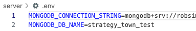
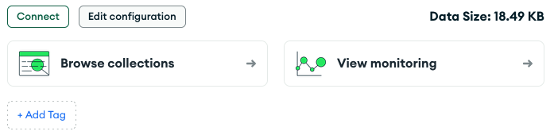

MongoDB Atlas is a cloud-based service that provides fully managed MongoDB databases. It allows you to easily deploy, manage, and scale MongoDB clusters without needing to handle server infrastructure, security, backups, or updates, making database management simpler and more efficient.

To use MongoDB Atlas, create a MongoDB account [here](https://account.mongodb.com/account/register).

After you register you will be asked to verify your email. After you do that, you can continue with the steps below.

### Setup your MongoDB Database

1. Navigate to your [MongoDB Account Profile](https://account.mongodb.com/account/profile/overview).
2. Click on the "Visit MongoDB Atlas" button.
3. Click on the "Create" button on the center of the screen. (If you don't see a "Create" button, make sure you are in the "Overview" section on the left navigation and on the "Data Services" tab)
4. In the configuration options:
   1. Choose the "Free" tier.
   2. For the Name, provide a name such as "db-cs4530-spring25-XYY" (where XYY is your group number).
   3. Keep the Provider and Region the default values.
   4. Uncheck "Preload sample dataset" under "Quick Setup"
5. Click on "Create Deployment".
6. You will be prompted about connecting to your database.
   1. Copy the username and password that is automatically generated. You will need this later (you can also create an user after the database has been created).
   2. Click on "Create Database User".
   3. Click the "Close" button.
7. Wait for your database cluster to complete creation. Once complete, click on the "Network Access" option in the left navigation.
8. Your current public IP address will be automatically present. Click the "EDIT" button, and then click "ALLOW ACCESS FROM ANYWHERE". Click the "Confirm" button.
9. Return to the "Overview" option in the left navigation. Click "Get connection string" next to "Application Development." You will need to save the connection string (starts with `mongodb+srv://`
but with `<db_password>` replaced by the password from step 6, part 1.

### Connect your project directory application to MongoDB

In your group project folder, create a file `server/.env`. Note that it shows up gray in the VS Code file menu — that is because this file is ignored by the `.gitignore` file as a protection against checking in secrets and environment variables stored in `.env` files.

Add the following contents to your `server/.env` file:

```
MONGODB_CONNECTION_STRING=<your connection string with password>
MONGODB_DB_NAME=strategy_town_test
```

The result should look like this:



To test your database connection, start your app as normal, create a new username and password, and make a forum post or start a game. Then log out and restart both dev servers. You should be able to log back in as the new user, and any games or forum posts you made should still be there.

### View database contents on Atlas

If you reload your overview page on MongoDB Atlas, you will see an option to "Browse collections."



If you click to browse collections, you can navigate through the collection with the name you specified (`strategy_town_test`), which will contain all the models you've encountered so far.

### Optional: MongoDB Compass

You can run persistent MongoDB databases on your own computer, and you can use MongoDB Compass as another way to access both those local databases and databases on Atlas. If you click on "Clusters" in left navigation, click on the "Connect" button, and then click "Compass," you will get instructions for installing MongoDB Compass.
