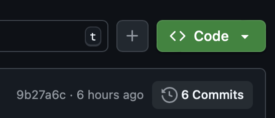

> **Generative AI tools may not be used for this assignment and must be turned off in any code editors you are using. You are expected to make a good-faith attempt to avoid reliance on "AI Overview" features in search engines, and to verify anything you see there with authoritative sources.**

## Objectives of this assignment

The objectives of this assignment are to:

- Continue to investigate and understand a large, existing codebase
- Understand the process of connecting your web application to a database using asynchronous operations
- Extend a web application built with React
- Use Sockets.IO to add real-time functionality to a web application

## Getting started

Start by accepting our [GitHub Classroom invitation](https://classroom.github.com/a/hX6ilajp) — this will be available after 6pm on May 13. It will create a GitHub repository for you which will include the starter code for this assignment. You will set up the assignment as before. Do not install any additional dependencies: **package.json must be unchanged**.

## Tasks

The code you start this assignment with is a viable solution to the first individual assignment, with of changes that you can inspect by going to your copy of the repository and clicking the "rewind clock" icon that has "N commits" next to it (for some value of N).



When you click on this, you'll be able to see the series of major changes made to the first project's code:

 - Making most of the service layer functions async
 - Making the app mostly stateless by moving user, thread, and game models into MongoDB
 - Updating test data to work with these new models.

### Task 1: Sharing biographical details

For this task, review the feedback on your conditions of satisfaction from individual project 1, and revise these to conditions of satisfaction. (You don't have to write any code for this task — that will come later!) Make sure that your essential conditions of satisfaction fulfill the needs of the user story. You **will** be accountable for the essential conditions of satisfaction in the third individual project.

Additionally, write a basic plan of work, a couple of sentences of additional detail about each condition of satisfaction that describe how you plan to go about satisfying the essential conditions of satisfaction.

You will also be working on your team project plan this week, and you may notice this plan has much more extensive documentation requirements. There are several reasons for this:

 1. Because you have control over the user stories for the group project plan, there's more potential for ambiguity.
 2. The group project plan is expected to be quite a bit more ambitious.
 3. You're expected to progress further in your group project. For this user story, you are not expected to get past the "essential" conditions of satisfaction. Group projects are expected to complete most if not all of their "desirable" conditions of satisfaction.
 4. The written plan for the group project plan is there to keep multiple people on the same page. As a general rule, projects that coordinate more people need more documentation to keep everyone on the same page.

It is **highly recommended** that you either review this part of the project in person with a member of the course staff or submit this part of the project early, especially if there were issues with your first conditions of satisfaction. If you submit on Gradescope by 6pm Friday, the course staff will have a chance to give you an extra round of feedback before the deadline to ensure you're on track.

### Task 2: A stateless server

*Most* of the models that were stored in memory for the first individual assignment have been moved to an appropriate repository layer, held in a MongoDB database.

The one part of the task left to you is the `Chat` and `Message` models. We recommend you take the following steps:

 - Remove `MessageRecord` and `storedMessages` from `server/src/services/message.service.ts`; likewise remove `ChatRecord` and `storedChats` from `server/src/servies/message/chat.service.ts`.
 - Replace these with appropriate new Mongoose models in `server/src/models/chat.model.ts` and `server/src/models/message.model.ts`. Study the previous diffs, especially the forum ones, to see how this should work.
 - Change `populateMessageInfo` and `populateChat` to read from `MessageModel.findById` and `ChatModel.findById` with appropriate `select` and `populate` modifiers, and change `createMessage` and `createChat` to use `MessageModel.insertOne` and `ChatModel.insertOne`.
 - If needed, update `chat.controller.ts` to adapt to any changes to the interface. It's okay if the service layer API changes slightly as long as the controller and service stay in an appropriate relationship. 

It will be extremely helpful to study the diffs where other Mongoose models were added, especially the diff that added forum models.

### Task 3: A new game

Modify both the client and the server to play Tic-Tac-Toe.

 - When a second player joins the game, the server should _randomly_ decide which player plays first, as X, and second, as O.
 - After the game starts, all users should see "(Player X's display name) is X" followed by "(Player Y's display name) is O", unless they are a player, in which case one of them should read "You are X" or "You are O" as appropriate.
 - When the game is active:
   - All players should see a 3x3 grid. For non-players, there should be no buttons, just either a blank grid space or a space containing X or O.
   - All users should see "(Player's display name) makes the next move as (X or O)" except for the person whose move it is: they should see "Your move".
   - The player should see text in each of the spaces where a move has been made, and an "Add X" or "Add O" in every open spot (X if they're the X player, O if they're the O player). These buttons should be visibly and actually [disabled](https://developer.mozilla.org/en-US/docs/Web/HTML/Reference/Attributes/disabled) when it is not their turn.
 - When a winning move is made or no more moves can be made, the game should move to the "Done" state.
 - When the game is done, all users should see the same grid of Xs and Os without buttons
 - When the game is done and someone won by getting three Xs or Os in a row or along a diagonal:
   - At least one winning line of Xs or Os should be highlighted
   - All users should see "(Player's display name) won" should be shown except the winner, who should see "You won"
 - When the game is done and there was no winner, all users should see "Stalemate"

You wil need to change all three parts of the project to do this.

The shared code needs to change:
 - In `shared/src/game.types.ts`, add a `zTicTacToeMove` validator and the types `TicTacToeView` and `TicTacToeMove`. You'll also need to extend `TaggedGameView` with a new branch `{ type: 'tictactoe', view: TicTacToeView }`.

The web server backend needs to change:
 - In `server/src/games`, you'll need to create `tictactoe.ts` that looks like this:

   ```ts
   import { GameService } from './gameServiceManager.ts';
   import { GameLogic } from './gameLogic.ts';
   import { TicTacToeView } from '@strategy-town/shared';

   type TicTacToeState = TicTacToeView;

   export const ticTacToeLogic: GameLogic<
     TicTacToeState,
     TicTacToeView
   > = {};

   export const ticTacToeService = new GameService<
     TicTacToeState,
     TicTacToeView
   >(ticTacToeLogic);
   ```
 
 - This won't typecheck yet! But that's okay. The other games weren't tested, and you should do better: create a file `server/tests/games/tictactoe.spec.ts` and write some tests for your `ticTacToeLogic` implementation. This may help you revise what your `TicTacToeView` type actually needs to look like.

 - Implement `ticTacToeLogic`, guided by your tests like a proper test-driven developer.

 - Add `tictactoe: ticTacToeService` to your `gameServices` map in `server/src/services/game.service.ts`.

The React frontend needs to change:
 - Implement the React frontend for your game in a new file `client/src/games/TicTacToeGame.tsx` and connect it to the application in `client/src/games/GameDispatch.tsx`.

### Task 4: Real time updates

It is desirable for the game page and the home page to update when new games are started using the Sockets.io interface.

The following steps are probably the most straightforward way to achieve this objective:

 - In `shared/src/socket.types.ts`, create a new server-to-client event `gameCreated` that sends a `GameInfo` object to clients.

 - On the backend, change the type of `postCreate` from `RestAPI<GameInfo>` to `(io: StrategyServer) -> RestAPI<GameInfo>`, and pass the websocket controller `io` to the function in `server/src/app.ts`.

 - Use the `io` object to send a `gameCreated` message to all connections when a game is created by the `postCreate` API endpoint.

 - On the home page and the game list page, listen for `gameCreated` messages and append the new game to the front of the list of games.

(Hopefully you can imagine other features that follow a similar pattern, such as updating the games list when the state of a game changes. You may also see more efficient ways to implement this functionality, like only sending the messages to people looking at the corresponding pages. If your groups' user stories would benefit from such improvements, that's worth considering!)

## Submission Instructions & Grading

You will submit task 1 via Gradescope, and Tasks 2-4 using GitHub Classroom.

The assignment is graded out of 120 points.

 - Task 1: 20 points
 - Task 2: 20 points
 - Task 3: 50 points
 - Task 4: 30 points

If your code fails the tests it comes with, or if it produces errors or warnings when `npm run check` or `npm run lint` is run in the `server` directory, you will get no credit on tasks 1-4 until you fix the error and resubmit with a 10 point penalty. Adding new `eslint-disable` statements, modifying `package.json` files, or modifying the linter configuration is not allowed.
