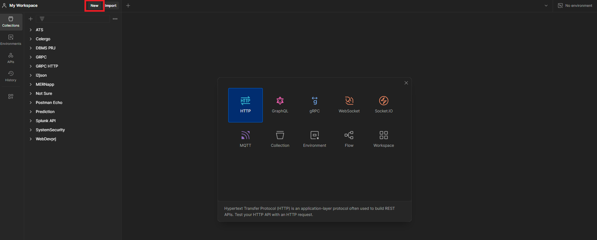
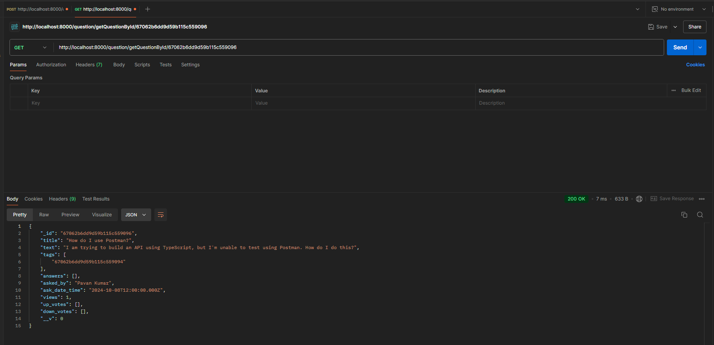
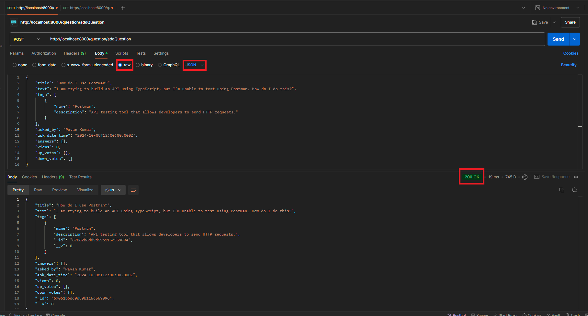

# Tutorial: Guide to API Requests and Installing Postman

## Contents
- [Introduction to API Requests and Postman](tutorials/postman#introduction-to-api-requests-and-postman)
- [Breakdown of an API Request](tutorials/postman#breakdown-of-an-api-request)
- [Steps to Install Postman](tutorials/postman#steps-to-install-postman)
- [Using Postman: Basic Steps](tutorials/postman#using-postman-basic-steps)
- [Saving API Requests and Using History](tutorials/postman#saving-api-requests-and-using-history)
- [Organizing Requests into Collections](tutorials/postman#organizing-requests-into-collections)
- [Recommended Tools](tutorials/postman#recommended-tools)

## Introduction to API Requests and Postman

APIs (Application Programming Interfaces) are essential tools that allow different software applications to communicate with each other. As developers, it's crucial to understand how to interact with APIs, which involves making API requests. API requests are structured interactions where one software sends a request to retrieve or send data to another.

Postman is a popular API testing tool that allows developers to build, test, and modify APIs quickly and easily. It provides an interface to interact with APIs and simplifies API development. Postman supports making requests like **GET**, **POST**, **PUT**, **DELETE**, and more.

With this guide, you can:
- **Understand the basics** of making GET and POST requests to an API.
- **Learn how to use Postman** to send requests and test APIs.
- **Test API responses** to ensure that they return the expected results.

### Types of API Requests:
There's a whole [vocabulary of HTTP requests](https://developer.mozilla.org/en-US/docs/Web/HTTP/Reference/Methods), but GET and POST are the two most important:

- **GET**: Retrieves data from an API. It's commonly used when you want to fetch information without making any changes.
  - *Example*: Use a GET request to retrieve a list of videos related to the one you're currently watching on a streaming platform (e.g., `GET /videos/related`).
  
- **POST**: Submits new data to an API to create a resource. It's used when you need to send data to the server to create something new.
  - *Example*: Use a POST request to save a newly uploaded video on a platform (e.g., `POST /videos`).

Each of these request types serves a specific purpose in API interactions, and Postman allows you to easily switch between them to test and build your APIs.

## Breakdown of an API Request

Each API request has key components:

### 1. URL
For this URL -> `https://localhost:8000/api/thread/list`

The URL defines the location of the API you're interacting with:
- **Protocol** (`https://`)
- **Domain** (`localhost`)
- **Port** (`8000`)
- **Endpoint** (`/api/thread/list`)

### 2. Method
Defines the action type:
- **GET**: Retrieves data
- **POST**: Submits new data
- **PUT**: Updates data
- **DELETE**: Deletes data

### 3. Parameters (GET) vs. Body (POST)
- **GET** can send query data as **query parameters** in the URL:
https://api.example.com/users?age=25
In this example, `age=25` is a query parameter used to filter the list of users.

- **POST** sends data in the **body** (in this class, this will always be JSON):
    ```json
    {
        "username": "newuser",
        "email": "newuser@example.com"
    }
    ```

### 4. Headers
Headers provide additional information about the request or the client making it. They help the server understand the request. Some common headers include:

- **Content-Type**: Specifies the format of the request body (e.g., `application/json` for JSON data).
- **Authorization**: Contains credentials like API keys or tokens required to access certain endpoints.
  - *Example*:
    ```
    Authorization: Bearer <your-api-token>
    ```

- **Accept**: Specifies the format in which the client expects the server to return the response (e.g., `application/json`).
  - *Example*:
    ```
    Accept: application/json
    ```

### 5. Response
After the server processes the request, it sends back a **response**. The response typically includes:

- **Status Code**: A number indicating the result of the request.
  - Common status codes:
    - `200 OK`: The request was successful.
    - `201 Created`: The resource was successfully created (used for POST requests).
    - `400 Bad Request`: There was an error in the request.
    - `404 Not Found`: The resource could not be found.
    - `500 Internal Server Error`: An error occurred on the server.

- **Response Body**: Contains the data returned by the API, usually in JSON format. For example, when creating a new user, the server might return a response like this:
  ```json
  {
      "id": 1,
      "username": "newuser",
      "email": "newuser@example.com"
  }
  ```

Mozilla documentation for reference: [https://developer.mozilla.org/en-US/docs/Web/HTTP/Status](https://developer.mozilla.org/en-US/docs/Web/HTTP/Status)

## Steps to Install Postman

### Step 1: Download Postman
1. Open your web browser and navigate to the official Postman website: [https://www.postman.com/downloads/](https://www.postman.com/downloads/).
2. Select the version that is compatible with your operating system (Windows/macOS). If you're using a Mac, be sure to download the version that corresponds to your system's chip (Intel or Apple).
3. Click the "Download" button.

### Step 2: Install Postman

#### For Windows:
1. Once the download is complete, find the setup file in your downloads folder (typically named `Postman-win64-setup.exe`).
2. Double-click the file to start the installation.
3. Follow the on-screen instructions to complete the installation. Postman will install automatically and open once the process is finished.

#### For macOS:
1. Open the downloaded `.dmg` file.
2. Drag the Postman app icon into the "Applications" folder.
3. Once copied, go to your Applications folder and double-click the Postman icon to launch the app.

### Step 3: Create an Account (Optional but Recommended)
Once Postman is installed:
1. Open the Postman application.
2. You will be prompted to sign in or create a Postman account.

## Using Postman: Basic Steps

### Step 0: Ensure your backend is running


### Step 1: Launch Postman
After installation, launch Postman. You'll see a workspace where you can start creating requests.

### Step 2: Make Your First API Request
1. Click on the "New" button at the top-left and select **HTTP**.

   

2. In the request window, choose the type of request method (GET, POST, PUT, DELETE) from the dropdown menu (default is GET).
3. Enter the URL of the API you want to test in the input field. (If you're running the course project, try `http://localhost:8000/api/thread/abadcafeabadcafeabadcafe/comment`). Ensure that the ID is valid and belongs to one of the questions in the database.

   

4. To send a POST request you need to enter the URL (e.g., `http://localhost:8000/question/addQuestion`) and include the Body as well.
    - Go to the **Body** tab.
    - Select **raw**.
    - Choose **JSON** as the format.
    - Enter the JSON data in this format:
    ```json
    {
      "auth": {
        "username": "user3",
        "password": "pwd3"
      },
      "payload": "I would like to play Nim"
    }
    ```
   

5. Click the **Send** button.

### Step 3: View the Response
- After clicking "Send," Postman will display the API response below the request window.
- You will see the **Status Code**, **Response Body**, **Headers**, and **Cookies** (if applicable).

## Saving API Requests and Using History

One of Postman's key features is the ability to **save API requests** for future use. This can save you time when testing or working on multiple endpoints. Additionally, Postman keeps track of your request history, allowing you to quickly revisit previous requests without re-entering all the details.

To learn more about using Postman's history, visit: [Postman History](https://learning.postman.com/docs/getting-started/basics/navigating-postman/#history).

## Organizing Requests into Collections

Postman also allows you to save and organize requests into **collections**. A collection is essentially a folder where you can store multiple requests, making it easier to manage large projects and share API workflows with your team.

For more information on creating and using collections, refer to the Postman documentation: [Postman Collections](https://learning.postman.com/docs/sending-requests/intro-to-collections/).

These features enhance your ability to efficiently manage, organize, and track your API development process within Postman.


## Recommended Tools

In addition to using the Postman desktop app, you can also integrate Postman with Visual Studio Code through the Postman extension. This extension allows you to send API requests directly from your code editor. 

You can find the extension and its documentation here: [Postman VS Code Extension](https://learning.postman.com/docs/getting-started/basics/about-vs-code-extension/).
